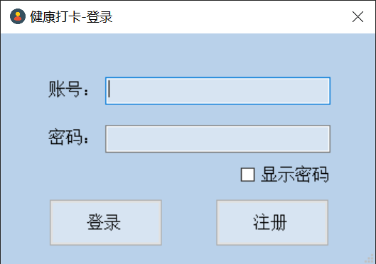
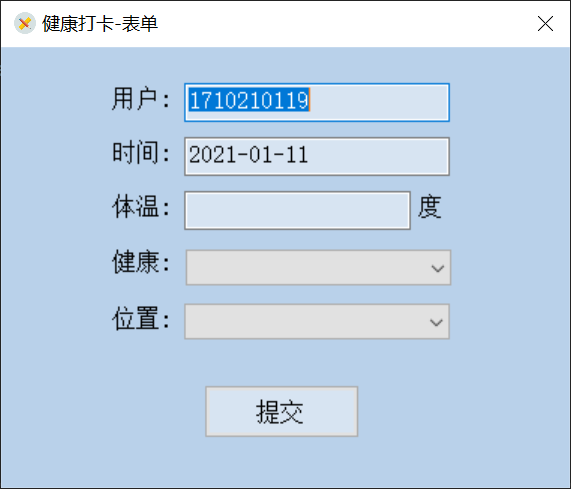
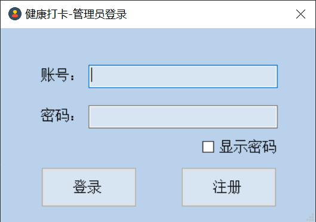

# HealthCheckIn
----

本项目为2017级河海大学计算机专业《计算机课程综合课程设计》项目。

需要文档的话可以email我，邮箱：qs4869@outlook.com。

## 功能

### 人员界面

启动程序后进入登录界面

输入账号密码后进入提交界面

点击提交即可健康打卡

### 管理员界面

启动程序后进入登录界面

登陆后进入管理界面，可查看学生信息和打卡信息

## 错误提示

若账号、密码、体温、健康、位置等信息未输入，则会弹窗报错

## 配置方法

因本项目使用了本地数据库，因此需要现在本地搭建数据库。

1. 下载sql server

2. 创建名为`HealthCheckIn`的数据库

3. 数据库中创建`personInfo`，`submitInfo`，`managerInfo`三张表

4. personInfo表：

   | 名称     | 类型     | 是否可为null |
   | -------- | -------- | ------------ |
   | account  | nvarchar | 是           |
   | password | nvarchar | 是           |

   

5. submitInfo表：

   | 名称        | 类型     | 是否可为null |
   | ----------- | -------- | ------------ |
   | account     | nvachar  | 是           |
   | time        | date     | 是           |
   | temperature | int      | 是           |
   | health      | nvarchar | 是           |
   | location    | nvarchar | 是           |

6. managerInfo表：

   | 名称     | 类型     | 是否可为null |
   | -------- | -------- | ------------ |
   | account  | nvarchar | 是           |
   | password | nvarchar | 是           |

7. 在代码的DataBaseHelper类中修改strConn，将server改为你的服务器名